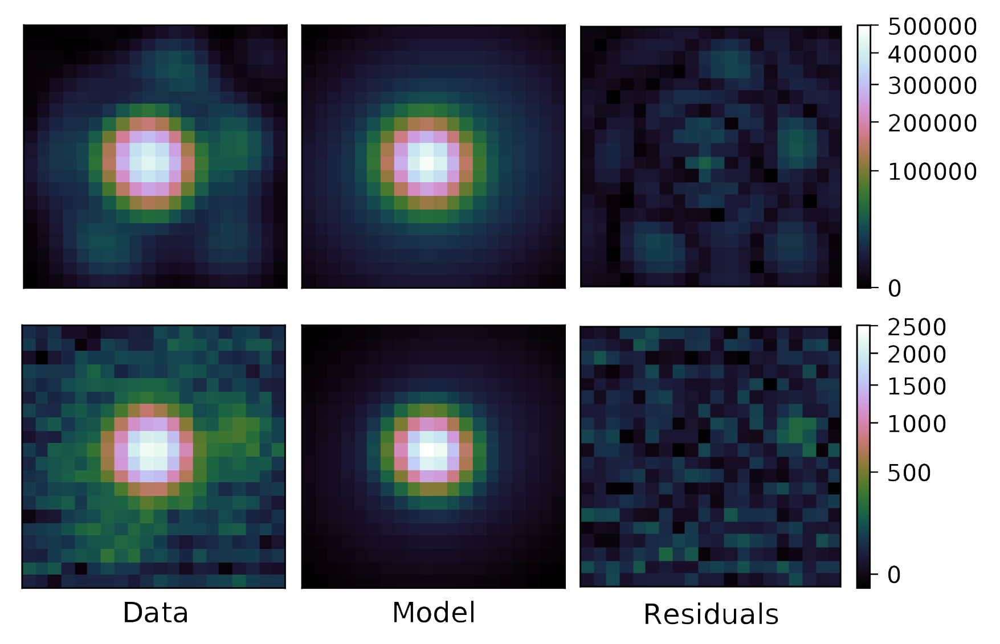

# LAPF:
### Logan's Analytical PSF Fitter

Fits a Gaussian 2d PSF model to Keck/NIRC2 data for companion to a central (unobscured) star
using a Gibbs sampler Metroplis-Hastings MCMC.  Runs in parallel, where each process acts an 
independent walker.  For details, see Pearce et. al. 2019.

LAPF works in three steps (plus an optional 4th):  
    - apf_step 1: Locate central object, companion, and empty sky area in the image  
    - apf_step 2a: MCMC using only one walker to fine-tune the intial guess before unleashing the walkers
               in step 2.  Optional step.  Step 2 will either take input from the output of step 2a or
               step 1 (set by the -i flag in step 2).  
    - apf_step 2: MCMC iterates on parameters of 2D model until a minimum number of trials  
               are conducted on each parameter.  Each process outputs their chain to an  
               individual file.  
               Designed to run on the Texas Advance Computing Center Lonestar 5 compter in parallel processing  
    - apf_step 3: Take in output of step 2 and apply corrections, including the NIRC2 distortion solutions of  
               Yelda et.al. 2010 and Service et.al. 2016, to determine relative separation  
               and position angle and corresponding metrics.  

Supporting scripts in this repository:  
    - make_squiggle_plots.py: Use relative astrometery from LAPF and Gaia position/proper motion to test for common proper motion between companion and star.

^ The analytical psf model generated in APF, compared with an example image of a star (top) and it's wide planetary mass companion (bottom).  The model consists of two 2D Gaussian functions, one to mdoel the diffraction-limited core, and a second to capture the wings.  The free parameters are: 
- x/y pixel postion for star and companion  
- x/y offset* for central peak of wide gaussain compared to narrow  
- amplitudes for wide and narrow gaussian and the ratio* of wide to narrow peak  
- standard deviation* in x and y direction for wide and narrow  
- rotation angle* for wide and narrow gaussian  

(* common value for star and companion)

This method for PSF fitting achieves Poisson-limited precision when combined with Keck/NIRC2 precision calibrations.  It has been used to generate results published in Pearce et.al 2019.

## Author
The project was completed by Logan Pearce (http://www.loganpearcescience.com), under the mentorship of Dr. Adam Kraus at the University of Texas at Austin.

## Acknowledgments

Software:
numpy, astropy

